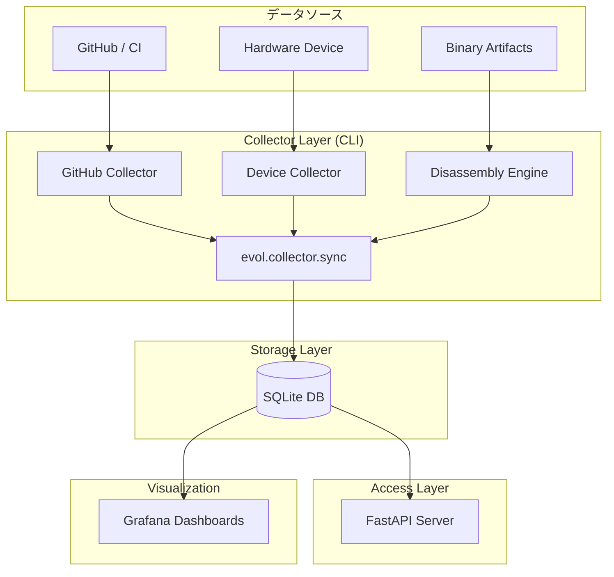
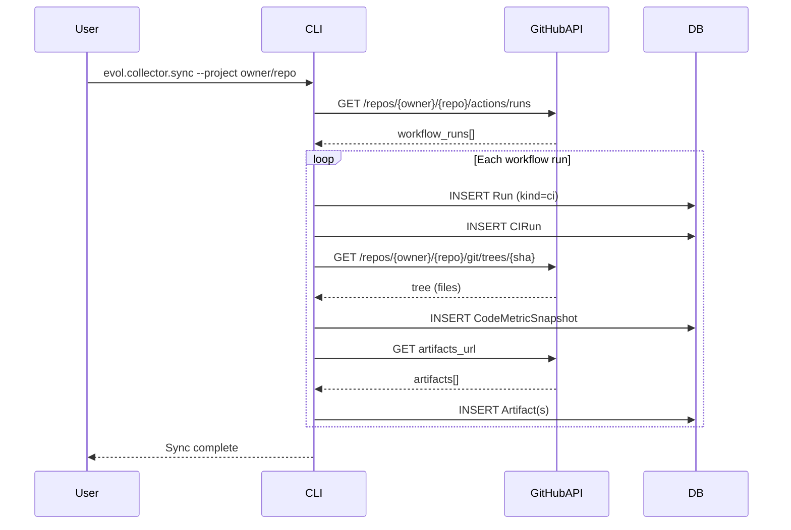
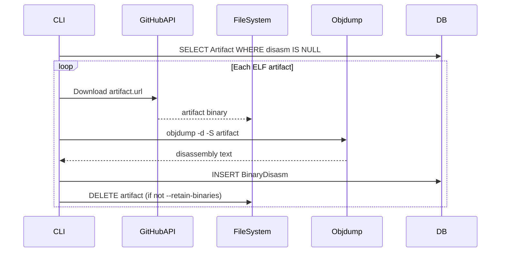

# EVOL v1 システムアーキテクチャドキュメント

**Version**: 1.0.0  
**Last Updated**: 2025-12-06  
**Status**: Release Candidate

---

## 目次

1. [概要](#1-概要)
2. [基本理念](#2-基本理念)
3. [アーキテクチャ概要](#3-アーキテクチャ概要)
4. [コンポーネント詳細](#4-コンポーネント詳細)
5. [データベーススキーマ](#5-データベーススキーマ)
6. [データフロー](#6-データフロー)
7. [APIリファレンス](#7-apiリファレンス)
8. [セキュリティとアクセス制御](#8-セキュリティとアクセス制御)
9. [運用ガイドライン](#9-運用ガイドライン)
10. [制約事項と非機能](#10-制約事項と非機能)

---

## 1. 概要

EVOL (Evolving Visual Observability Layer) v1は、ソフトウェアとファームウェアの進化における**不変の事実の記憶 (Immutable Factual Memory)** を提供する観察基盤です。

### 主要特徴
- **Non-intrusive**: CI/CDパイプラインやデバイスを変更せずに観察
- **Unified Timeline**: CI実行とハードウェアテストを統一タイムラインで管理
- **Disassembly Storage**: バイナリの進化をアセンブリレベルで追跡
- **Read-Only Access**: データは観察のみ、意味解析や最適化は外部システム（LPAD/SEDA）に委譲

### 対象ユーザー
- ファームウェア開発者
- CI/CDエンジニア
- QAエンジニア
- DevOpsチーム

---

## 2. 基本理念

### 2.1 Observer Only (観察者)
EVOLは「何が起きたか」のみを記録し、「なぜ」は記録しません。
- ❌ ログの意味解析
- ❌ バグの検出
- ❌ パフォーマンス最適化の提案
- ✅ 事実の記録のみ

### 2.2 Immutable (不変性)
一度記録された歴史は決して変更されません。
- Append-only データベース設計
- 削除・更新操作なし（v1では）
- URLの期限切れは記録されるが、履歴は残る

### 2.3 Unified (統一性)
すべてのテレメトリは単一の概念である **Run** に紐づけられます。
- CI実行 → `Run(kind=ci)`
- ハードウェアテスト → `Run(kind=device)`
- 将来的な拡張 → `Run(kind=future)`

---

## 3. アーキテクチャ概要



---

## 4. コンポーネント詳細

### 4.1 Collector Layer (`evol.collector`)

#### 4.1.1 CLI (`sync.py`)
**エントリーポイント**: `python -m evol.collector.sync`

**主要オプション**:
```bash
--project owner/repo       # GitHubリポジトリ（必須: GitHub同期時）
--since TIMESTAMP          # 指定日時以降のデータを取得
--include-disasm           # ELF逆アセンブリを有効化
--import-device FILE       # デバイスダンプファイルをインポート
--retain-binaries          # ダウンロードしたバイナリを保持
```

**Single Writer原則**: 複数のCollectorインスタンスを並列実行しないこと（v1では制御なし、運用上の制約）

#### 4.1.2 GitHub Collector (`github.py`)
**機能**:
- GitHub Actions API経由でワークフロー実行を取得
- アーティファクトメタデータの収集
- Git Tree APIを使用したコードメトリクス計算

**取得データ**:
- Workflow runs (status, duration, trigger)
- Artifacts (name, size, download URL)
- Logs (URL only, コンテンツは取得しない)
- Code metrics (バイト数ベース)

**リトライロジック**:
- 最大3回リトライ
- バックオフ: 1秒 → 2秒 → 4秒

#### 4.1.3 Device Collector (`device.py`)
**機能**:
- ファイルベースのテレメトリダンプをインポート
- メタデータのみ保存（wave形式などの生データは参照のみ）

**制約**:
- v1ではファイルフォーマットの自動判定なし
- デバイスモデル/シリアルは手動入力またはプレースホルダー

#### 4.1.4 Disassembly Engine (`disasm.py`)
**ツール**: `objdump -d -S`

**サポート対象**:
- ELF形式バイナリ
- フォールバック: `arm-none-eabi-objdump`

**保存内容**:
- 完全な逆アセンブリテキスト
- objdumpバージョン（再現性保証）

---

### 4.2 Storage Layer (`evol.db`)

#### 4.2.1 Database (`database.py`)
- **Backend**: SQLite
- **Connection**: `DATABASE_URL` 環境変数から取得（デフォルト: `sqlite:///./evol.db`）
- **Session Management**: FastAPI Dependencyパターン

#### 4.2.2 Models (`models.py`)
詳細は次 セクション [5. データベーススキーマ](#5-データベーススキーマ) を参照

---

### 4.3 Access Layer (`evol.api`)

#### 4.3.1 FastAPI Application (`main.py`)
- **設計原則**: 完全読み取り専用
- **Pagination**: すべてのリストエンドポイントで必須
- **エラーハンドリング**: HTTPException使用

詳細は [7. APIリファレンス](#7-apiリファレンス) を参照

---

### 4.4 Visualization (`dashboards/`)

#### 4.4.1 Grafana
**接続方法**: SQLiteプラグイン経由でDBに直接接続

**主要ダッシュボード**:
- **Unified Timeline**: CIとデバイス実行の統合ビュー
- **LOC Growth**: コードサイズの推移（バイト数）
- **Artifact Count**: アーティファクト生成数の推移
- **Disassembly Index**: 逆アセンブリ履歴のテーブルビュー

---

## 5. データベーススキーマ

### 5.1 ER図

```mermaid
erDiagram
    Run ||--o| CIRun : "1:0..1"
    Run ||--o| DeviceRun : "1:0..1"
    Run ||--o{ Artifact : "1:N"
    Run ||--o| LogMeta : "1:0..1"
    Run ||--o| CodeMetricSnapshot : "1:0..1"
    DeviceRun ||--o{ SignalStream : "1:N"
    Artifact ||--o| BinaryDisasm : "1:0..1"
    
    Run {
        string run_id PK
        string kind
        string repo_id
        string commit_sha
        datetime started_at
        datetime ended_at
        string status
        string external_ci_id
        string external_device_session_id
        string description
    }
    
    CIRun {
        string run_id PK_FK
        string trigger
        float duration_seconds
        string default_branch
        int tag_count
        int branch_count
    }
    
    DeviceRun {
        string run_id PK_FK
        string device_model
        string device_serial
        string interface_type
    }
    
    Artifact {
        string artifact_id PK
        string run_id FK
        string name
        string file_type
        int size_bytes
        string url
        datetime created_at
    }
    
    BinaryDisasm {
        string artifact_id PK_FK
        text disasm_text
        datetime generated_at
        string tool_version
    }
```

### 5.2 テーブル詳細

#### Run (中心テーブル)
| カラム | 型 | NULL | 説明 |
|--------|-----|------|------|
| run_id | String (UUID) | NO | 主キー |
| kind | String | NO | `ci` / `device` / `future` |
| repo_id | String | YES | リポジトリ識別子 |
| commit_sha | String | YES | Gitコミットハッシュ |
| started_at | DateTime | YES | 開始時刻（インデックス） |
| ended_at | DateTime | YES | 終了時刻 |
| status | String | NO | `success` / `failure` / `cancelled` / `unknown` |
| external_ci_id | String | YES | 外部CI ID（GitHub Actions Run ID等） |
| external_device_session_id | String | YES | 外部デバイスセッションID |
| description | String | YES | 説明文 |

**インデックス**: `kind`, `repo_id`, `started_at`

---

## 6. データフロー

### 6.1 GitHub同期フロー



### 6.2 Disassembly フロー



---

## 7. APIリファレンス

### 7.1 エンドポイント一覧

| Endpoint | Method | 説明 | Pagination |
|----------|--------|------|------------|
| `/api/v1/projects` | GET | プロジェクト一覧 | No |
| `/api/v1/runs` | GET | Run一覧 | Yes |
| `/api/v1/ci-runs` | GET | CI Run一覧 | Yes |
| `/api/v1/device-runs` | GET | Device Run一覧 | Yes |
| `/api/v1/artifacts` | GET | Artifact一覧 | Yes |
| `/api/v1/metrics/loc` | GET | LOCメトリクス一覧 | Yes |
| `/api/v1/logs` | GET | Log メタデータ一覧 | Yes |
| `/api/v1/signals` | GET | Signal Stream一覧 | Yes |
| `/api/v1/disasm` | GET | Disassembly取得 | No |

### 7.2 Paginationパラメータ

すべてのリストエンドポイントで利用可能:
- `skip`: オフセット（デフォルト: 0）
- `limit`: 最大取得件数（デフォルト: 100, 最大: 1000）

### 7.3 使用例

```bash
# プロジェクト一覧取得
curl http://localhost:8000/api/v1/projects

# CI Runを取得（ページング）
curl "http://localhost:8000/api/v1/ci-runs?repo_id=owner/repo&skip=0&limit=50"

# Disassembly取得
curl "http://localhost:8000/api/v1/disasm?artifact_id=uuid-here"
```

---

## 8. セキュリティとアクセス制御

### 8.1 認証
- **GitHub PAT**: 読み取り専用スコープ（`repo:status`, `actions:read`）
- **.env管理**: トークンは環境変数として管理、Gitにコミットしない

### 8.2 ネットワークアクセス
- **許可**: `api.github.com` のみ
- **禁止**: その他の外部ネットワーク

### 8.3 データベースアクセス
- **Single-tenant**: ローカルSQLiteファイル
- **アクセス制御**: ファイルシステムのパーミッションに依存

---

## 9. 運用ガイドライン

### 9.1 セットアップ

```bash
# 1. 依存関係インストール
pip install -e .

# 2. 環境変数設定
cp .env.example .env
# .envにGITHUB_TOKENを設定

# 3. データベース初期化
alembic upgrade head
```

### 9.2 定期実行（推奨）

```bash
# Cron例: 毎時0分に実行
0 * * * * cd /path/to/evol && python -m evol.collector.sync --project owner/repo --include-disasm
```

### 9.3 バックアップ

```bash
# SQLiteファイルをバックアップ
cp evol.db evol.db.backup.$(date +%Y%m%d)
```

### 9.4 監視

- **ログ**: stdout/stderrを監視
- **DB成長**: `evol.db`のファイルサイズをモニタリング
- **API Health**: `/api/v1/projects`エンドポイントをヘルスチェックに使用

---

## 10. 制約事項と非機能

### 10.1 EVOLが行わないこと（明示的な境界）

- ❌ ログの意味解析
- ❌ バグ検出
- ❌ パフォーマンス最適化
- ❌ CI/CDワークフローの変更
- ❌ ハードウェアへのフィードバック
- ❌ AI推論（v1）

### 10.2 スケーラビリティ制約

- **SQLite制約**: 単一ライターのみ、大規模並列クエリには不向き
- **Tree API制約**: 大規模リポジトリではtruncated=trueとなる可能性

### 10.3 将来的な改善（v2以降）

- PostgreSQL/MySQLサポート
- リアルタイムストリーミング取り込み
- スケジューラー内臓
- 実際のLOCカウント（現状はバイト数）
- 並列実行制御（ロック機構）

---

## 付録

### A. 用語集

- **Run**: EVOL内の最小単位、すべてのテレメトリの親
- **CI Run**: GitHub Actionsなどの継続的統合実行
- **Device Run**: ハードウェアテスト実行
- **Artifact**: ビルド成果物（バイナリ、ログファイル等）
- **Disassembly**: ELFバイナリの逆アセンブリテキスト

### B. 関連システム

- **LPAD**: Log Pattern Anomaly Detection（未実装、将来的な解析層）
- **SEDA**: Software Evolution Decision Advisor（未実装、将来的な最適化層）

---

**Document End**
