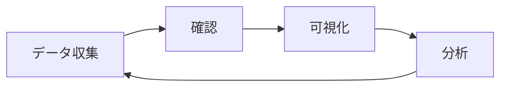

# EVOL 統合操作手順書

**Version**: 1.1.0  
**対象**: 運用担当者、開発者、QAエンジニア

---

## 📋 目次

1. [事前準備](#1-事前準備)
2. [初回セットアップ](#2-初回セットアップ)
3. [日常運用](#3-日常運用)
4. [データ確認・分析](#4-データ確認分析)
5. [トラブルシューティング](#5-トラブルシューティング)
6. [メンテナンス](#6-メンテナンス)
7. [実践例](#7-実践例)

---

## ⚡ クイックスタート（2分で開始）

### 完全自動セットアップ

```bash
# 1. リポジトリをクローン
git clone https://github.com/capybara-works/EVOL.git
cd EVOL

# 2. 自動セットアツプを実行（GitHubトークン入力が必要）
./quickstart.sh

# 3. データを同期してGrafanaで確認
./sync_and_view.sh owner/repo
```

**これだけです！** Grafanaで可視化が始まります。

### 主要な自動化スクリプト

| スクリプト | 用途 | 実行例 |
|-----------|------|--------|
| `quickstart.sh` | 初回セットアップ | `./quickstart.sh` |
| `sync_and_view.sh` | 同期＋Grafana起動 | `./sync_and_view.sh owner/repo` |
| `batch_sync.sh` | 複数リポジトリ一括同期 | `./batch_sync.sh --disasm` |

詳細は以降のセクションで説明します。

---

## 1. 事前準備

### 1.1 必要な環境

| 項目 | 必須/推奨 | 備考 |
|------|-----------|------|
| Python 3.10以上 | 必須 | `python3 --version` で確認 |
| Git | 必須 | バージョン管理 |
| Docker | 推奨 | Grafana実行用 |
| objdump | オプション | 逆アセンブリ機能使用時 |

### 1.2 GitHubトークンの準備

1. GitHubにログイン
2. Settings → Developer settings → Personal access tokens → Tokens (classic)
3. "Generate new token" をクリック
4. 以下のスコープを選択:
   - ✅ `repo:status`
   - ✅ `public_repo` (パブリックリポジトリのみの場合)
   - ✅ `actions:read`
5. トークンを生成してコピー（**一度しか表示されません**）

---

## 2. 初回セットアップ

### 2.1 リポジトリのクローン

```bash
# 1. リポジトリをクローン
git clone https://github.com/capybara-works/EVOL.git
cd EVOL

# 2. ディレクトリ構造を確認
ls -la
```

**期待される出力**:
```
evol/
alembic/
dashboards/
grafana/
README.md
ARCHITECTURE.md
...
```

### 2.2 依存関係のインストール

**方法A: pip**
```bash
pip install -e .
```

**方法B: Poetry（推奨）**
```bash
# Poetryがない場合はインストール
curl -sSL https://install.python-poetry.org | python3 -

# 依存関係をインストール
poetry install
poetry shell  # 仮想環境を有効化
```

### 2.3 環境変数の設定

```bash
# 1. .envファイルを作成
cp .env.example .env

# 2. エディタで.envを開く
nano .env  # または vim, code など

# 3. GitHubトークンを設定
# GITHUB_TOKEN=ghp_xxxxxxxxxxxxxxxxxxxx
```

**設定内容**:
```bash
DATABASE_URL=sqlite:///./evol.db
GITHUB_TOKEN=your_github_pat_here
EVOL_RETAIN_BINARIES=false  # オプション: ダウンロードしたバイナリを保持するか
```

**環境変数の説明**:
- `DATABASE_URL`: データベース接続文字列（デフォルト: SQLite）
- `GITHUB_TOKEN`: GitHub Personal Access Token（必須）
- `EVOL_RETAIN_BINARIES`: `true`の場合、逆アセンブリ後もバイナリファイルを削除しない（デフォルト: `false`）

### 2.4 データベースの初期化

```bash
# Alembicでスキーマを作成
alembic upgrade head
```

**成功時の出力**:
```
INFO  [alembic.runtime.migration] Running upgrade  -> xxxxx, initial schema
```

**確認**:
```bash
# evol.dbが作成されたことを確認
ls -lh evol.db
```

---

## 3. 日常運用

### 3.1 基本ワークフロー



### 3.2 データ収集

#### パターン1: GitHub CI実行履歴の取得

```bash
# 基本形
python -m evol.collector.sync --project owner/repo

# 例: capybara-works/EVOLリポジトリを同期
python -m evol.collector.sync --project capybara-works/EVOL

# 逆アセンブリを含める
python -m evol.collector.sync \
  --project capybara-works/EVOL \
  --include-disasm

# 特定日時以降のデータのみ
python -m evol.collector.sync \
  --project capybara-works/EVOL \
  --since 2025-12-01
```

**実行時の出力例**:
```
Syncing GitHub project: capybara-works/EVOL
GitHub sync complete
```

#### パターン2: ハードウェアテレメトリのインポート

```bash
# デバイスダンプファイルをインポート
python -m evol.collector.sync \
  --import-device /path/to/device_session.dump

# 例
python -m evol.collector.sync \
  --import-device ~/hardware_tests/test_20251206.bin
```

**実行時の出力例**:
```
Importing device dump: ~/hardware_tests/test_20251206.bin
Device run imported: 12345678-1234-1234-1234-123456789abc
```

#### パターン3: 複合実行

```bash
# CI + ハードウェアテストを同時に処理
python -m evol.collector.sync \
  --project capybara-works/EVOL \
  --include-disasm \
  --import-device ~/tests/latest.dump
```

### 3.3 定期実行の設定

#### Cronの設定（推奨）

```bash
# crontabを編集
crontab -e

# 毎時0分に実行
0 * * * * cd /path/to/EVOL && /usr/bin/python3 -m evol.collector.sync --project capybara-works/EVOL >> /var/log/evol_sync.log 2>&1

# 毎日午前2時に実行（逆アセンブリ付き）
0 2 * * * cd /path/to/EVOL && /usr/bin/python3 -m evol.collector.sync --project capybara-works/EVOL --include-disasm >> /var/log/evol_sync.log 2>&1
```

**ログの確認**:
```bash
tail -f /var/log/evol_sync.log
```

---

## 4. データ確認・分析

### 4.1 API経由での確認

#### APIサーバーの起動

```bash
# 開発モード（自動リロード有効）
uvicorn evol.api.main:app --reload --host 0.0.0.0 --port 8000

# 本番モード
uvicorn evol.api.main:app --host 0.0.0.0 --port 8000
```

#### エンドポイントの使用例

**プロジェクト一覧**:
```bash
curl http://localhost:8000/api/v1/projects
```

**CI実行履歴**:
```bash
# 直近100件
curl "http://localhost:8000/api/v1/ci-runs?limit=100"

# 特定リポジトリのみ
curl "http://localhost:8000/api/v1/ci-runs?repo_id=capybara-works/EVOL"

# ページング
curl "http://localhost:8000/api/v1/ci-runs?skip=100&limit=50"
```

**失敗したCI実行を検索**:
```bash
curl "http://localhost:8000/api/v1/runs?status=failure"
```

**アーティファクト一覧**:
```bash
curl "http://localhost:8000/api/v1/artifacts?repo_id=capybara-works/EVOL"
```

**逆アセンブリ取得**:
```bash
# artifact_idを指定
curl "http://localhost:8000/api/v1/disasm?artifact_id=12345678-1234-1234-1234-123456789abc"
```

#### API ドキュメント

ブラウザで以下にアクセス：
- **Swagger UI**: http://localhost:8000/docs
- **ReDoc**: http://localhost:8000/redoc

### 4.2 WebUI経由での操作（v1.1+）

#### WebUIの起動

```bash
# 起動スクリプトを使用（推奨）
./start-ui.sh

# または直接実行
uvicorn evol.ui.app:app --host 127.0.0.1 --port 8080
```

**アクセス**:
- URL: http://localhost:8080
- 認証: なし（ローカル開発用）

#### 主な機能

**Control Panel ダッシュボード**:
- **System Status**: Total Runs、Total Artifacts、Last Sync、Grafana稼働状態
- **Quick Actions**: リポジトリ同期フォーム、Grafana/APIリンク
- **Recent Syncs**: 最近の同期履歴（最新5件）

**操作手順**:

1. **リポジトリ同期**:
   ```
   - Project欄に `owner/repo` を入力
   - （オプション）"Include Disassembly" にチェック
   - "🔄 Sync Repository" ボタンをクリック
   ```

2. **Grafana表示**:
   ```
   - "📈 Open Grafana" ボタンをクリック
   - 新しいタブでGrafanaダッシュボードが開く
   ```

3. **API Docs表示**:
   ```
   - "📖 API Docs" ボタンをクリック
   - Swagger UIが開く
   ```

**自動更新**: ステータスは30秒ごとに自動更新されます

**バックグラウンド実行**: 同期処理はバックグラウンドで実行され、ブラウザを閉じても継続します

### 4.3 Grafana経由での可視化

#### Grafanaの起動

```bash
# Grafanaコンテナを起動
docker-compose up -d

# ログを確認
docker-compose logs -f grafana
```

**アクセス**:
- URL: http://localhost:3000
- デフォルト認証: `admin` / `admin`

#### ダッシュボードの確認

1. ログイン後、左メニューから "Dashboards" をクリック
2. "EVOL Overview" を選択
3. 以下のパネルが表示されます:
   - **Unified Run Timeline**: CI/デバイス実行の統合ビュー
   - **LOC Growth**: コードサイズの推移
   - **Artifact Count**: アーティファクト数の推移
   - **Disassembly Index**: 逆アセンブリ履歴

#### 時間範囲の変更

右上のタイムピッカーで:
- Last 6 hours
- Last 24 hours
- Last 7 days
- カスタム範囲

---

## 5. トラブルシューティング

### 5.1 よくあるエラーと対処

#### エラー1: `GITHUB_TOKEN not found`

**原因**: 環境変数が設定されていない

**対処**:
```bash
# 1. .envファイルを確認
cat .env

# 2. トークンが設定されているか確認
echo $GITHUB_TOKEN

# 3. 手動で設定
export GITHUB_TOKEN=your_token_here

# 4. 再実行
python -m evol.collector.sync --project owner/repo
```

#### エラー2: `objdump not found`

**原因**: objdumpがインストールされていない

**対処**:

**macOS**:
```bash
brew install binutils
```

**Ubuntu/Debian**:
```bash
sudo apt-get install binutils
```

**ARM用（Raspberry Pi Pico等）**:
```bash
# macOS
brew install --cask gcc-arm-embedded

# Ubuntu
sudo apt-get install gcc-arm-none-eabi
```

#### エラー3: `database locked`

**原因**: 複数のCollectorが同時実行されている

**対処**:
```bash
# 1. 実行中のプロセスを確認
ps aux | grep evol.collector.sync

# 2. 必要に応じてプロセスを終了
kill <PID>

# 3. 再実行
```

#### エラー4: Grafanaにデータが表示されない

**チェックリスト**:
```bash
# 1. データベースファイルの存在確認
ls -lh evol.db

# 2. データが存在するか確認
sqlite3 evol.db "SELECT COUNT(*) FROM runs;"

# 3. Grafanaコンテナの再起動
docker-compose restart grafana

# 4. データソース設定を確認
# Grafana UI: Configuration → Data Sources → EVOL SQLite
```

### 5.2 ログの確認

```bash
# Collectorのログ（stdout）
python -m evol.collector.sync --project owner/repo 2>&1 | tee evol_sync.log

# APIサーバーのログ
uvicorn evol.api.main:app --log-level debug

# Grafanaのログ
docker-compose logs grafana
```

---

## 6. メンテナンス

### 6.1 バックアップ

```bash
# データベースのバックアップ
cp evol.db evol.db.backup.$(date +%Y%m%d_%H%M%S)

# 定期バックアップ（cron）
0 3 * * * cp /path/to/EVOL/evol.db /path/to/backup/evol.db.$(date +\%Y\%m\%d)
```

### 6.2 データベースサイズの確認

```bash
# ファイルサイズ
du -h evol.db

# レコード数
sqlite3 evol.db <<EOF
SELECT 'runs', COUNT(*) FROM runs
UNION ALL
SELECT 'artifacts', COUNT(*) FROM artifacts
UNION ALL
SELECT 'disasm', COUNT(*) FROM binary_disasm;
EOF
```

### 6.3 古いデータの削除（v2以降で実装予定）

現在、EVOL v1ではデータ削除機能は未実装です。手動で削除する場合:

```bash
# 90日以前のCIRunを削除
sqlite3 evol.db <<EOF
DELETE FROM runs 
WHERE started_at < datetime('now', '-90 days') 
AND kind = 'ci';
EOF

# VACUUM（ディスク領域の開放）
sqlite3 evol.db "VACUUM;"
```

### 6.4 依存関係の更新

```bash
# Poetry使用時
poetry update

# pip使用時
pip install --upgrade -e .

# セキュリティアップデート確認
poetry show --outdated
```

---

## 7. 実践例

### 7.1 シナリオ1: 新規プロジェクトの監視開始

**目的**: 新しいファームウェアプロジェクトのCI実行を記録開始

```bash
# 1. 初回同期（過去30日分）
python -m evol.collector.sync \
  --project mycompany/firmware \
  --since $(date -d '30 days ago' +%Y-%m-%d) \
  --include-disasm

# 2. Cronで定期実行設定
crontab -e
# 毎時実行
0 * * * * cd /path/to/EVOL && python3 -m evol.collector.sync --project mycompany/firmware --include-disasm

# 3. Grafanaで確認
docker-compose up -d
open http://localhost:3000
```

### 7.2 シナリオ2: バグ調査

**状況**: v2.1.0でバグが報告された。いつ混入したか調査

```bash
# 1. v2.1.0のCI実行を検索
curl "http://localhost:8000/api/v1/runs?repo_id=mycompany/firmware" | \
  jq '.[] | select(.commit_sha | startswith("abc123"))'

# 2. そのコミットのアーティファクトを取得
curl "http://localhost:8000/api/v1/artifacts?repo_id=mycompany/firmware"

# 3. 逆アセンブリを比較
curl "http://localhost:8000/api/v1/disasm?artifact_id=<v2.1.0_id>" > v2.1.0.asm
curl "http://localhost:8000/api/v1/disasm?artifact_id=<v2.0.0_id>" > v2.0.0.asm
diff v2.0.0.asm v2.1.0.asm
```

### 7.3 シナリオ3: ハードウェアテスト結果の統合

**目的**: CIビルドとハードウェアテストを紐付け

```bash
# 1. 朝: CI実行を同期
python -m evol.collector.sync --project mycompany/firmware

# 2. 午後: ハードウェアテスト実施後、結果をインポート
python -m evol.collector.sync \
  --import-device ~/hardware_tests/pico_test_$(date +%Y%m%d).dump

# 3. Grafanaで統合タイムラインを確認
# → CIビルドとハードウェアテストが同じグラフに表示される
```

### 7.4 シナリオ4: コードサイズの推移監視

**目的**: コードサイズが閾値を超えたらアラート

```bash
# 1. APIでLOCメトリクスを取得
curl "http://localhost:8000/api/v1/metrics/loc?repo_id=mycompany/firmware" | \
  jq '.[0].total_loc'

# 2. シェルスクリプトで閾値チェック
#!/bin/bash
THRESHOLD=1000000  # 1MB
CURRENT=$(curl -s "http://localhost:8000/api/v1/metrics/loc?repo_id=mycompany/firmware&limit=1" | jq '.[0].total_loc')

if [ $CURRENT -gt $THRESHOLD ]; then
  echo "Warning: Code size exceeded $THRESHOLD bytes"
  # Slack通知などを追加
fi

# 3. Cronで定期実行
0 */6 * * * /path/to/check_code_size.sh
```

---

## 📝 チェックリスト

### 初回セットアップ
- [ ] Pythonバージョン確認（3.10以上）
- [ ] リポジトリクローン
- [ ] 依存関係インストール
- [ ] GitHubトークン取得・設定
- [ ] .envファイル作成
- [ ] データベース初期化（alembic upgrade head）
- [ ] 初回同期実行
- [ ] Grafana起動確認

### 日常運用
- [ ] Cron設定（自動同期）
- [ ] ログローテーション設定
- [ ] バックアップスクリプト作成
- [ ] Grafanaダッシュボード確認

### トラブル発生時
- [ ] エラーログ確認
- [ ] 環境変数確認
- [ ] データベース整合性チェック
- [ ] ディスク空き容量確認

---

## 🔗 関連ドキュメント

- [README.md](README.md) - プロジェクト概要
- [ARCHITECTURE.md](ARCHITECTURE.md) - 技術詳細
- [PUBLISHING.md](PUBLISHING.md) - 開発者向けガイド

---

**Note**: この手順書は継続的に更新されます。問題や改善提案があれば、GitHubでIssueを作成してください。
